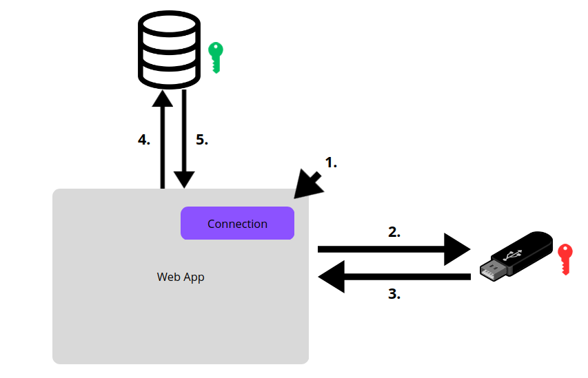

# ZKP-auth

This project proposes a minimalistic frontend built with Next.js, designed as a simple and efficient interface for testing the authentication workflow. The frontend allows users to interact naturally with the application, focusing specifically on the authentication experience without unnecessary complexity or design elements.

The backend is implemented in Go and communicates via REST APIs. Go is chosen for its high performance, reliability, and efficient concurrency management, making it ideal for scalable microservices architectures. REST APIs are preferred because they offer simple integration, broad interoperability with various clients, and ease of deployment, while remaining robust for security-oriented applications. Together, Go and REST APIs enable the development of modular authentication services that can be easily integrated into any project, promoting modularity and simplifying deployment on distributed systems.

At the heart of the system is Zero Knowledge Proof authentication, which ensures that users can log in securely without exposing sensitive credentials. The microservice setup means the authentication mechanism is self-contained and can be easily adopted in multiple applications. By leveraging a ZKP protocol, the project enables users to authenticate by proving possession of their private key, while the backend verifies the cryptographic proof using the public key linked to each account. This approach ensures maximum security, privacy, and user convenience, aligning with best practices for modern identity and access management.

## Installation

```bash
cd frontend/
npm install

cd backend/
go mod tidy
```

To start the frontend :

```bash
cd frontend/
npm run dev
```

To start the backend :

```bash
cd backend/
go run main.go
```

## Explanation of what ZKP (Zero Knowledge Proof) is

A Zero Knowledge Proof is a cryptographic protocol allowing one party, called the prover, to convince another party, the verifier, that the prover possesses certain knowledge, without revealing any detail about that knowledge itself.

Zero Knowledge Proof ensures privacy while enabling reliable verification The prover can convince the verifier of the truthfulness of a statement such as knowing a password or owning funds without disclosing the content of the secret This strengthens both security and privacy and is especially relevant in modern systems like authentication, cryptocurrency, or decentralized identity.

The protocol usually involves a challenge and response mechanism The prover produces a reply that depends on secret information The verifier then sends a random challenge, and the prover must give a correct response This procedure is repeated several times to prevent cheating As a result, even after many rounds, the verifier learns only that the prover truly knows the secret, without obtaining any further information.

A Zero Knowledge Proof is defined by three essential properties Completeness means that if the statement is true and the protocol is properly followed, the verifier will be convinced Soundness ensures that if the statement is false, a dishonest prover is extremely unlikely to convince the verifier The zero-knowledge property guarantees that the verifier obtains no extra information about the secret beyond the validity of the claim.

## How the project works



1. Click the Connection button
2. Check if a USB drive is present and if it contains a private key
3. "Yes, there is a USB drive with a private key" or "No USB drive detected" or "No private key on the USB drive"
4. If there is a private key, check the database to see if there is an associated public key
5. If so, the connection will be established

In this project, the database contains a User table with two columns, "username" and "public_key". When a user wants to create an account, they will enter a username and generate a key pair. The public key is stored in the database at registration, and the private key is automatically downloaded as a file by the user. This file is meant to be saved on a USB drive, which does not have to be empty; any storage device will do.

To sign in to the application, the user inserts their USB drive into the computer and clicks the "Login" button. The application reads the private key file and uses it to complete a challenge issued by the server. The server generates a random challenge message whenever an authentication attempt occurs, ensuring that each session is unique and secure.

Using a Zero Knowledge Proof protocol, the user produces a cryptographic proof calculated from the challenge and their private key. This proof is sent to the server, which uses the public key associated with the username to verify the proof’s validity. At no point is the private key itself or any critical secret transmitted over the network. Only the result of the cryptographic proof travels between the application and the server, enabling secure authentication.

This approach guarantees privacy for the user since the server never learns anything about the private key beyond the fact that the user possesses it. Security is maximized, as the compromise of the database alone cannot put user accounts at risk without the private key stored on the USB device. Furthermore, this method eliminates traditional passwords, eliminating the risk of password interception, leakage, or phishing attacks, and reinforcing the overall security of the system.
